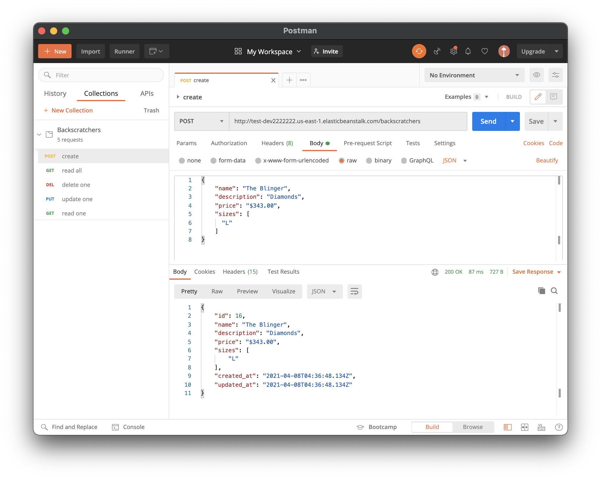
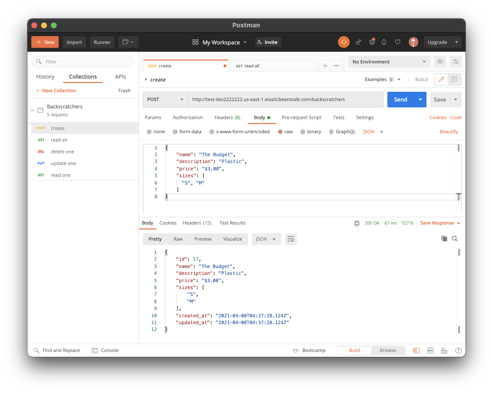
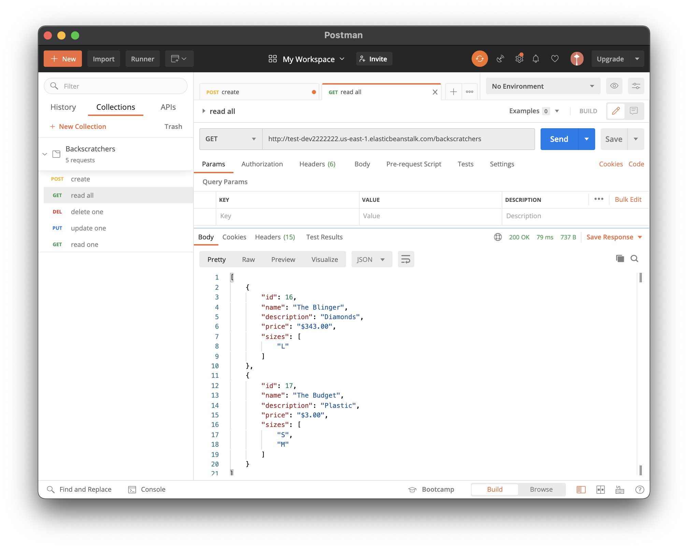
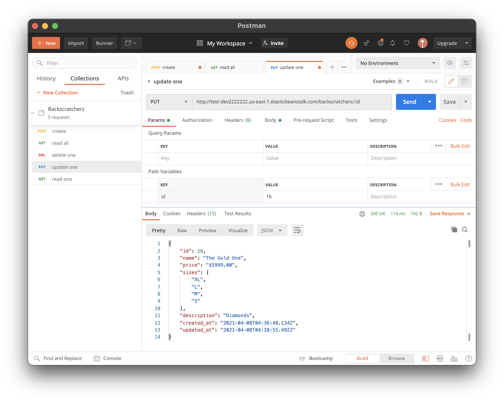
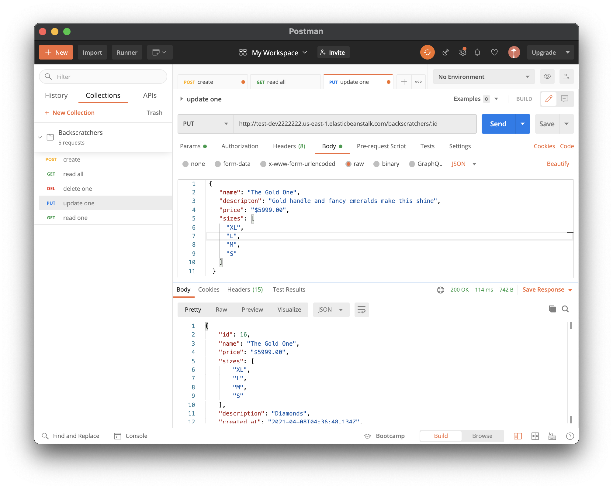
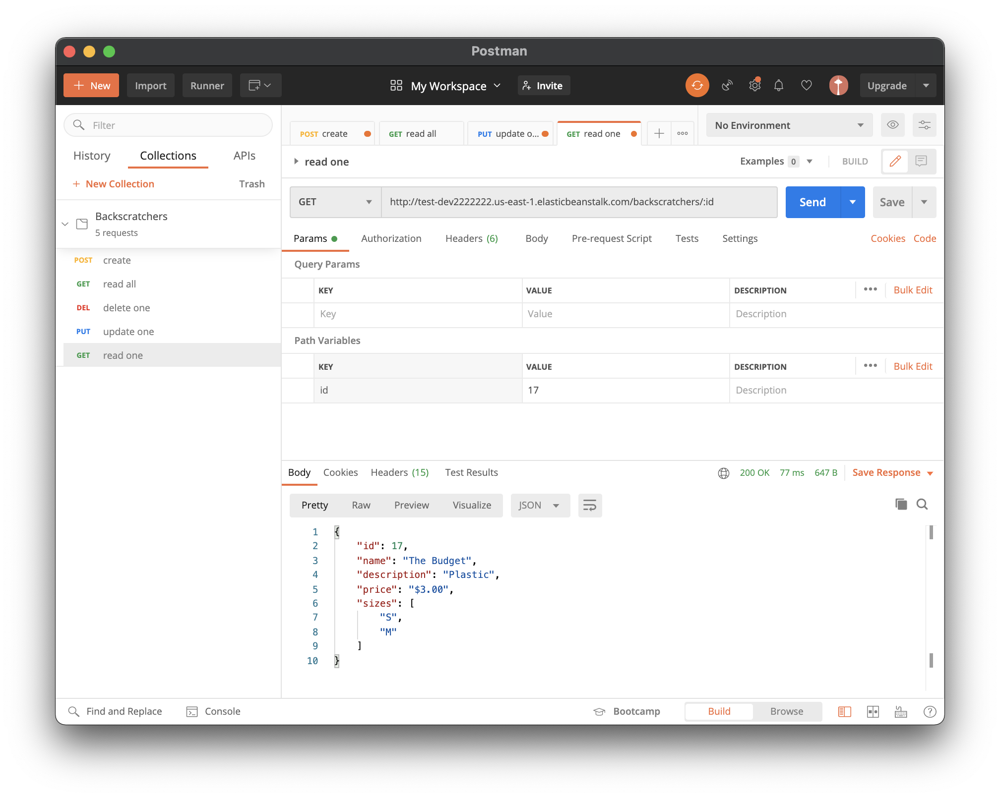
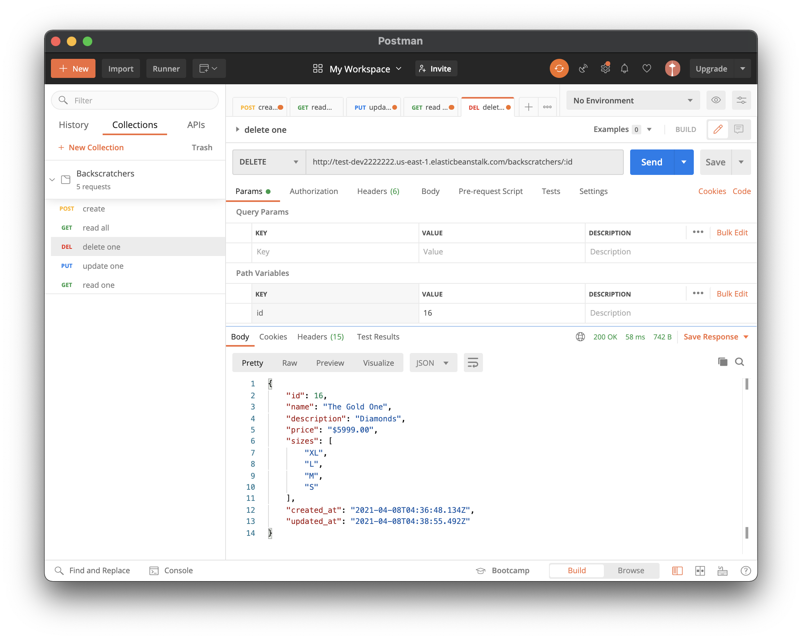

# README

Created a simple API for using Ruby on Rails for CRUD operations on a database.

Deployed to AWS Elastic Beanstalk using an EC2 instance, and PostgreSQL RDS database

Backend running at:
http://test-dev2222222.us-east-1.elasticbeanstalk.com

## ENDPOINTS

- GET /backscratchers
  Lists all the backscratchers. I decided to also include the id field for later use.

- GET /backscratchers/:id
  List the backscratcher with id

- POST /backscratchers
  Creates new backscratcher resource

- PUT /backscratchers/:id
  Updates (replaces) backscratcher resource with id

- DELETE /backscratchers/:id
  Deletes backscatcher resource with id

## POSTMAN

For testing, I included the Postman api calls in the file Backscratchers.postman_collecion.json. To use click "Import" in Postman, and upload the aforementioned file.

1. Create api call

   - go to Body tab

   - choose raw, then choose JSON from the drop down menu on the right

   - enter data in JSON format like below

   - press send

```json
{
  "name": "The Gold One",
  "descripton": "Gold handle and fancy emeralds make this shine",
  "price": "$5999.00",
  "sizes": ["XL", "L", "M", "S"]
}
```




2. Read All

   - press send



3. Update One

   - go to Params tab

   - in the Path Variables table, set the value for the key id as the id of the backscratcher to update

   - go to Body tab

   - choose raw, then choose JSON from the drop down menu on the right

   - enter data in JSON format like below

   - press send

```json
{
  "name": "The Gold One",
  "descripton": "Gold handle and fancy emeralds make this shine",
  "price": "$5999.00",
  "sizes": ["XL", "L", "M", "S"]
}
```




4. Read One

   - go to Params tab

   - in the Path Variables table, set the value for the key id as the id of the backscratcher to read

   - press send



5. Delete

   - go to params tab

   - in the path variables table, set the value for the key id as the id of the backscratcher to delete

   - press send


